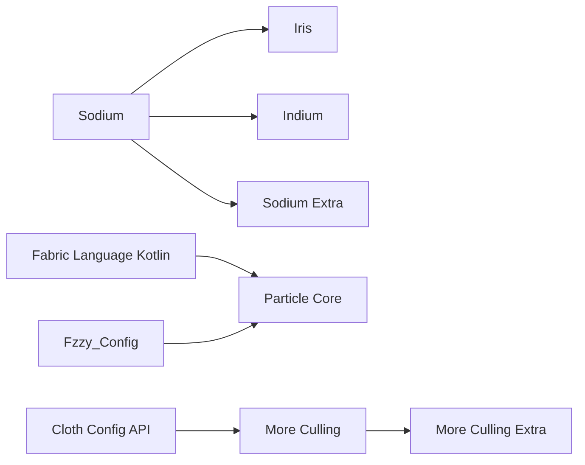
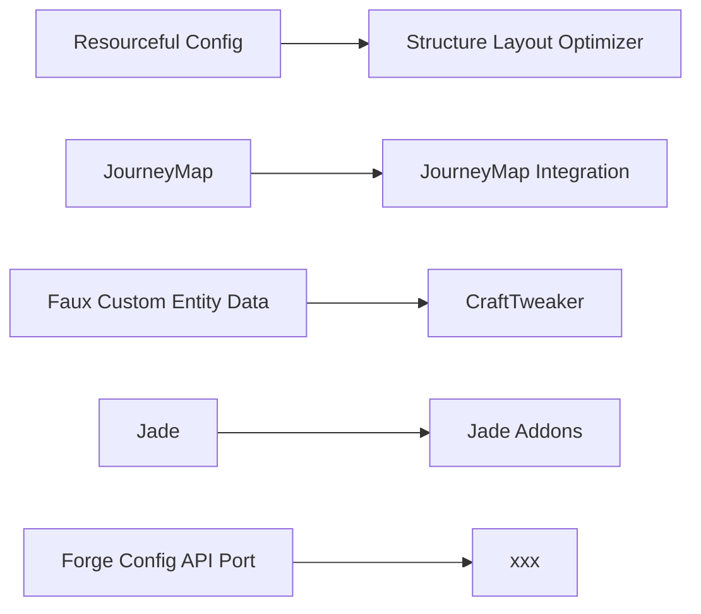
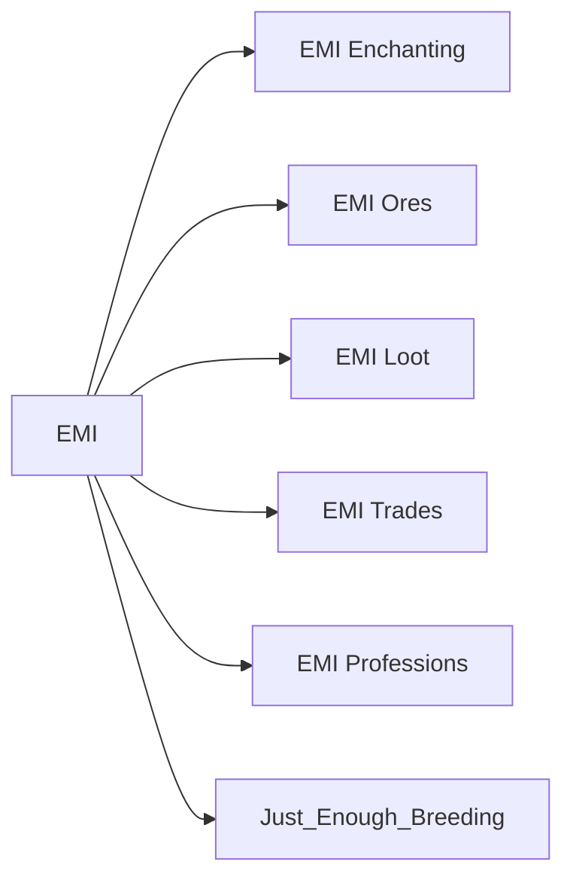
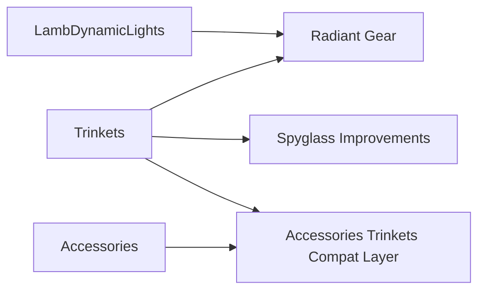
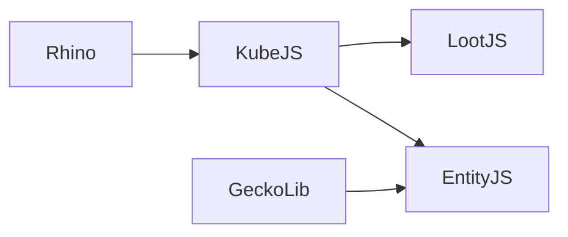

# Mod listing

| Mod | Tags | Version | Description |
| - | - | - | - |
| **Rendering optimization** | | | |
| [Sodium](https://www.curseforge.com/projects/455508) | `rendering` - `optimization` | 0.5.13 | Fast rendering engine |
| [ImmediatelyFast](https://www.curseforge.com/projects/686911) | `rendering` - `optimization` | 1.2.14 | Immediate mode rendering optimizations |
| [EntityCulling-Fabric](https://modrinth.com/mod/NNAgCjsB) | `rendering` - `optimization` | 1.9.5* | Aggressive async entity culling |
| [Particle Core](https://www.curseforge.com/projects/985426) | `rendering` - `optimization` | 0.2.5 | Faster particle rendering |
| [More Culling](https://www.curseforge.com/projects/630104) | `rendering` - `optimization` | 0.24.0 | More types of block face culling |
| [More Culling Extra](https://modrinth.com/mod/dFKMFBrn) | `rendering` - `optimization` | 1.1 | Even more types of block face culling |
| [Clumps](https://www.curseforge.com/projects/256717) | `rendering` - `optimization` | 12.0.0.4 | Clump xp orbs more aggressively |
| [Bedrodium](https://modrinth.com/mod/5roWs6VO) | `rendering` - `optimization` | 0.2.2 | Cull bottom layer of the bedrock |
| [Exordium](https://modrinth.com/mod/DynYZEae) | `rendering` - `optimization` | 1.2.1 | Render GUI at lower FPS |
| [FeyTweaks](https://www.curseforge.com/projects/663213) | `rendering` - `optimization` | 1.2.7 | Sign & beacon culling |
| **Rendering features** | | | |
| [Iris](https://www.curseforge.com/projects/394468) | `rendering` - `api` | 1.7.6 | Shader support |
| [Indium](https://www.curseforge.com/projects/459496) | `rendering` - `api` | 1.0.36 | Fabric rendering API support for Sodium |
| [LambDynamicLights](https://www.curseforge.com/projects/393442) | `rendering` - `api` | 2.3.2 | Dynamic light updates for entities |
| [RadiantGear](https://www.curseforge.com/projects/602199) | `rendering` - `api` | 2.1.0 | Dynamic light for wearable items |
| [Sodium Extra](https://www.curseforge.com/projects/447673) | `rendering` - `QoL` | 0.5.4 | Expanded settings for Sodium |
| **Server optimization** | | | |
| [ModernFix](https://www.curseforge.com/projects/790626) | `server` - `optimization` | 5.17.0 | General game improvements |
| [Lithium](https://www.curseforge.com/projects/360438) | `server` - `optimization` | 0.11.4* | General server optimizations |
| [FerriteCore](https://www.curseforge.com/projects/459857) | `server` - `optimization` | 6.0.1 | Tighter data packing to reduce RAM usage |
| [AlternateCurrent](https://www.curseforge.com/projects/548115) | `server` - `optimization` | 1.9.0 | Optimized redstone engine |
| [Very Many Players](https://www.curseforge.com/projects/552542) | `server` - `optimization` | 0.2.0+beta.7.102 | High player count optimizations |
| [BadOptimization](https://www.curseforge.com/projects/949555) | `server` - `optimization` | 2.1.1 | Small server optimizations |
| [Krypton](https://www.curseforge.com/projects/428912) | `server` - `optimization` | 0.2.3 | Networking optimizations |
| [Icterine](https://www.curseforge.com/projects/974774) | `server` - `optimization` | 1.3.0 | Faster advancement checking |
| **Worldgen optimization** | | | |
| [C2ME](https://www.curseforge.com/projects/533097) | `worldgen` - `optimization` | 0.2.0+alpa.11.16 | Multi-threaded worldgen |
| [LazyDFU](https://www.curseforge.com/projects/433518) | `worldgen` - `optimization` | 0.1.3 | Reduces redundant DataFixerUpper work |
| [Noisium]() | `worldgen` - `optimization` | 2.0.3 | Faster worldgen noise computation |
| [Structure Layout Optimizer](https://www.curseforge.com/projects/1087831) | `worldgen` - `optimization` | 1.0.10 | Faster jigsaw structure generation |
| **Startup optimization** | | | |
| [ThreadTweak](https://modrinth.com/mod/vSEH1ERy) | `startup` - `optimization` | 0.1.1 | Adds thread priority customization |
| **Privacy** | | | |
| [No Telementry](https://www.curseforge.com/projects/530816) | `privacy` | 1.8.0 | Disables built-in telemetry |
| [No Report Button](https://www.curseforge.com/projects/658722) | `privacy` | 1.5.0 | Disables chat reports |
| [No Chat Reports](https://www.curseforge.com/projects/634062) | `privacy` - `gui` | 2.2.2 | Removes account signature used by chat reporting |
| [No Resource Pack Warnings](https://www.curseforge.com/projects/627242) | `gui` | 1.3.0 | Disables pack version warning |
| [Disable Custom Worlds Advice]() | `gui` | 4.1 | Disables popup on world creation |
| [Disable New World Creation Screen]() | `gui` | 1.1.0 | Legacy world creation menu |
| [Yeetus Experimentus]() | `gui` | 2.3.1-6 | Disables experimental settings popup |
| [Realms Button Remover](https://www.curseforge.com/projects/851513) | `gui` | 2.0.2 | Disables realms button |
| [Game Menu Remove GFARB](https://www.curseforge.com/projects/420519) | `gui` | 2.1.2 | Disables feedback and bug report buttons |
| [Not Enough Recipe Book](https://www.curseforge.com/projects/738663) | `gui` - `optimization` | 0.3 | Remove recipe book together with its NBT |
| **Library mods** | | | |
| [Fabric API](https://www.curseforge.com/projects/306612) | `api` | 0.92.2 | Extended mod loader API |
| [Architecture API](https://www.curseforge.com/projects/419699) | `api` | 9.2.14 | Multi-platform mod API |
| [Balm](https://www.curseforge.com/projects/500525) | `api` | 7.2.2 | Multi-platform mod API |
| [Collective](https://www.curseforge.com/minecraft/mc-mods/collective) | `api` | 7.57 | Multi-platform mod API |
| [Fabric Language Kotlin](https://www.curseforge.com/projects/308769) | `api` | 1.12.3 | Kotlin language API |
| [Rhino](https://www.curseforge.com/projects/416294) | `api` | 2001.2.3-10 | JS interpreter |
| [GeckoLib](https://www.curseforge.com/projects/388172) | `api` | 4.7.4 | Entity animation API |
| [Faux Custom Entity Data](https://www.curseforge.com/projects/575305) | `api` | 6.0.1 | Persistent entity data API |
| [Cloth Config API](https://www.curseforge.com/projects/348521) | `api` | 11.1.136 | Config API |
| [Forge Config API Port](https://www.curseforge.com/minecraft/mc-mods/forge-config-api-port) | `api` | 8.0.0 | Config API |
| [Fzzy Config](https://www.curseforge.com/projects/1005914) | `api` | 0.6.9 | Config API |
| [Resourceful Config](https://www.curseforge.com/projects/714059) | `api` | 2.1.3 | Config API |
| [Trinkets](https://www.curseforge.com/projects/341284) | `api` | 3.7.2 | Trinket slot API |
| [Accessories](https://www.curseforge.com/minecraft/mc-mods/accessories) | `api` | 1.0.0-beta.47 | Accessory slot API |
| [Accessories Trinkets Compat Layer](https://www.curseforge.com/minecraft/mc-mods/accessories-tc-layer) | `api` | 3.8.1-beta.14 | Slot API compatibility |
| **Developer tools** | | | |
| [KubeJS](https://www.curseforge.com/projects/238086) | `dev` - `api` | 2001.5.5-16 | JS modpack scripting framework |
| [LootJS](https://www.curseforge.com/projects/570630) | `dev` | 2.13.0 | Loot modification hooks for KubeJS |
| [EntityJS](https://www.curseforge.com/projects/967617) | `dev` | 0.2.4.1 | Entity modification hooks for KubeJS |
| [CraftTweaker](https://www.curseforge.com/projects/239197) | `dev` - `api` | 14.0.38 | ZenScript modpack scripting framework |
| [Spark](https://www.curseforge.com/minecraft/mc-mods/spark) | `dev` - `optimization` | 1.10.53 | Integrated performance profiler |
| [BetterF3](https://www.curseforge.com/minecraft/mc-mods/betterf3) | `dev` - `gui` | 7.0.2 | More readable debug GUI |
| [Mod Menu](https://www.curseforge.com/projects/308702) | `dev` - `gui` | 7.2.2 | In-game mod browser |
| [Open Loader](https://www.curseforge.com/projects/354339) | `dev` | 19.0.4 | Global pack loading |
| [Resource Pack Overrides](https://www.curseforge.com/projects/832644) | `dev` | 8.0.3 | Configurable pack loading |
| [WITS](https://www.curseforge.com/projects/909375) | `dev` - `commands` | 1.1.0 | Detect structures at current position |
| **EMI** | | | |
| [EMI](https://www.curseforge.com/projects/580555) | `emi` - `api` | 1.1.22 | Recipe and item viewer |
| [Just Enough Items](https://www.curseforge.com/projects/238222) | `emi` - `api` | 15.20.0.106 | JEI API compatibility for EMI |
| [EMI Enchanting](https://www.curseforge.com/projects/936713) | `emi` | 0.1.2 | EMI plugin for enchantments |
| [EMI Loot](https://www.curseforge.com/projects/681783) | `emi` | 0.7.9 | EMI plugin for loot tables |
| [EMI Ores](https://www.curseforge.com/projects/974009) | `emi` | 1.2 | EMI plugin for ore generation |
| [EMI Trades](https://www.curseforge.com/projects/735523) | `emi` | 1.2.1 | EMI plugin for villager trades |
| [EMI Professions](https://www.curseforge.com/projects/1065904) | `emi` | 1.0.4 | EMI plugin for villager workstations |
| [Just Enough Breeding](https://www.curseforge.com/projects/899386) | `emi` | 2.5.0 | EMI plugin for breeding information |
| **Navigation** | | | |
| [JourneyMap](https://www.curseforge.com/projects/32274) | `navigation` - `QoL` | 5.10.3 | Worldmap, minimap and waypoints |
| [JourneyMap Integration](https://www.curseforge.com/projects/525447) | `navigation` - `QoL` | 0.14.45 | Mod integration plugin for JourneyMap |
| [Jade](https://www.curseforge.com/projects/324717) | `navigation` - `QoL` | 11.8.0 | Shows what your're looking at |
| [Jade Addons](https://www.curseforge.com/projects/656665) | `navigation` - `QoL` | 5.2.3 | Mod integration plugin for Jade |
| [Regex Search](https://www.curseforge.com/projects/910354) | `navigation` - `QoL` | 1.3.0 | Regex container search |
| [Spyglass Improvements](https://www.curseforge.com/projects/571264) | `navigation` - `QoL` | 1.5.12 | Spyglass zoom with trinket support |
| [Nature's Compass](https://www.curseforge.com/projects/252848) | `navigation` - `QoL` | 2.2.3 | Compass for finding biomes |
| [Explorer's Compass](https://www.curseforge.com/projects/491794) | `navigation` - `QoL` | 2.2.3 | Compass for finding structures |
| [Urkaz Moon Tools](https://www.curseforge.com/projects/362825) | `navigation` - `QoL` | 2.1.1-39 | Clock for detecting the moon phase |
| **Inventory management** | | | |
| [Inventory Essentials](https://www.curseforge.com/minecraft/mc-mods/inventory-essentials) | `inventory` - `QoL` | 8.1.0 | desc |
| [Inventory Sorting](https://www.curseforge.com/projects/325471) | `inventory` - `QoL` | 1.9.0 | desc |
| [Stack to Nearby Chests](https://www.curseforge.com/minecraft/mc-mods/stack-to-nearby-chests) | `inventory` - `QoL` | 0.5.4 | Terraria-like stacking mechanics |
| [Stack Refill](https://www.curseforge.com/minecraft/mc-mods/stack-refill) | `inventory` - `QoL` | 4.2 | Refill items in hand from inventory |
| [What's that slot]() | `inventory` - `QoL` | 1.3.4 | Detect items accepted by a slot |
| **Inventory tooltips** | | | |
| [Adaptive Tooltips]() | `tooltip` - `QoL` | 1.3.0 | Adaptive tooltip format and line breaking |
| [Tooltip Scroll]() | `tooltip` - `QoL` | 1.3.0 | Long tooltips are scrollable |
| [Map Tooltip]() | `tooltip` - `QoL` | 3.0.0 | Render maps in a tooltip |
| [Durability Tooltip]() | `tooltip` - `QoL` | 1.1.5 | Item durability tooltips |
| [Legendary Tooltip]() | `tooltip` - `QoL` | 1.4.5 | Fancy tooltip borders |
| [Equipment Compare]() | `tooltip` - `QoL` | 1.3.8 | RPG-like item compare |
| **Commands** | | | |
| [Smart Completion]() | `navigation` - `QoL` | 1.2 | Better modded command autocomplete |
| [Suggestion Tweaker]() | `navigation` - `QoL` | 1.5.1 | Better command autocomplete filtering |
| **Testing** | | | |

| [Fabric Waystones]() | `navigation` | 3.3.2 | desc |
| [name]() | `` | ver | desc |

| Mod | Tags | Version | Description |
| - | - | - | - |
| **Rendering optimization** | | | |
| [Sodium](https://www.curseforge.com/projects/455508) | `rendering` - `optimization` | 1.2.0 | Fast rendering engine |

## Dependency graphs

