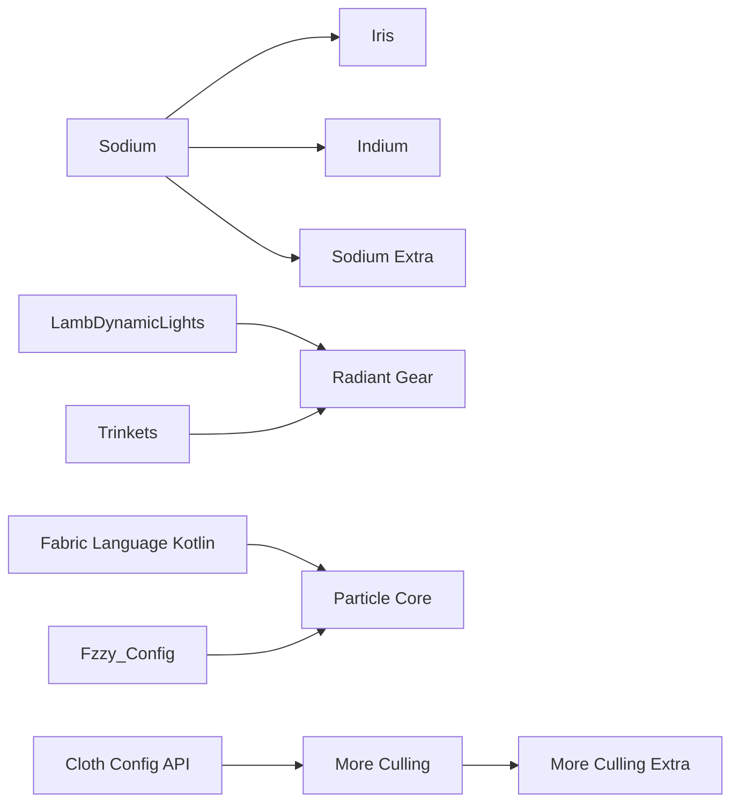

# Mod listing

| Mod | Tags | Version | Description |
| - | - | - | - |
| **Rendering optimization** | | | |
| [Sodium](https://www.curseforge.com/projects/455508) | `rendering` - `optimization` | 0.5.13 | Fast rendering engine |
| [ImmediatelyFast](https://www.curseforge.com/projects/686911) | `rendering` - `optimization` | 1.2.14 | Immediate mode rendering optimizations |
| [EntityCulling-Fabric](https://modrinth.com/mod/NNAgCjsB) | `rendering` - `optimization` | 1.9.5* | Aggressive async entity culling |
| [Particle Core](https://www.curseforge.com/projects/985426) | `rendering` - `optimization` | 0.2.5 | Faster particle rendering |
| [More Culling](https://www.curseforge.com/projects/630104) | `rendering` - `optimization` | 0.24.0 | More types of block face culling |
| [More Culling Extra](https://modrinth.com/mod/dFKMFBrn) | `rendering` - `optimization` | 1.1 | Even more types of block face culling |
| [Clumps](https://www.curseforge.com/projects/256717) | `rendering` - `optimization` | 12.0.0.4 | Clump xp orbs more aggressively |
| [Bedrodium](https://modrinth.com/mod/5roWs6VO) | `rendering` - `optimization` | 0.2.2 | Cull bottom layer of the bedrock |
| [Exordium](https://modrinth.com/mod/DynYZEae) | `rendering` - `optimization` | 1.2.1 | Render GUI at lower FPS |
| [FeyTweaks](https://www.curseforge.com/projects/663213) | `rendering` - `optimization` | 1.2.7 | Sign & beacon culling |
| **Rendering features** | | | |
| [Iris](https://www.curseforge.com/projects/394468) | `rendering` - `api` | 1.7.6 | Shader support |
| [Indium](https://www.curseforge.com/projects/459496) | `rendering` - `api` | 1.0.36 | Fabric rendering API support for Sodium |
| [LambDynamicLights](https://www.curseforge.com/projects/393442) | `rendering` - `api` | 2.3.2 | Dynamic light updates for entities |
| [RadiantGear](https://www.curseforge.com/projects/602199) | `rendering` - `api` | 2.1.0 | Dynamic light for wearable items |
| [Sodium Extra](https://www.curseforge.com/projects/447673) | `rendering` - `QoL` | 0.5.4 | Expanded settings for Sodium |
| **Server optimization** | | | |
| [ModernFix]() | `server` - `optimization` | 5.17.0 | General game improvements |
| [Lithium]() | `server` - `optimization` | 0.11.2 | General server optimizations |
| [FerriteCore]() | `server` - `optimization` | 6.0.1 | Tighter data packing to reduce RAM usage |
| [AlternateCurrent]() | `server` - `optimization` | 1.8.0+beta.3 | Optimized redstone engine |
| [Very Many Players]() | `server` - `optimization` | 0.2.0+beta.7.102 | High player count optimizations |
| [BadOptimization]() | `server` - `optimization` | 2.1.1 | Small server optimizations |
| [Krypton]() | `server` - `optimization` | 0.2.3 | Networking optimizations |
| [Icterine]() | `server` - `optimization` | 1.3.0 | Faster advancement checking |
| **Worldgen optimization** | | | |
| [C2ME]() | `worldgen` - `optimization` | 0.2.0+alpa.11.15 | Multi-threaded worldgen |
| [LazyDFU]() | `worldgen` - `optimization` | 0.1.3 | Reduces redundant DataFixerUpper work |
| [Noisium]() | `worldgen` - `optimization` | 2.0.3 | Faster worldgen noise computation |
| [Structure Layout Optimizer]() | `worldgen` - `optimization` | 1.0.10 | Faster jigsaw structure generation |
| **Startup optimization** | | | |
| [ThreadTweak]() | `startup` - `optimization` | 0.1.1 | Adds thread priority customization |
| **Privacy** | | | |
| [Not Enough Recipe Book]() | `removal` - `optimization` | 0.3 | Remove recipe book together with its NBT |
| **API** | | | |
| [Fabric API](https://www.curseforge.com/projects/306612) | `api` | 0.92.2 | Extended mod loader API |
| [Trinkets](https://www.curseforge.com/projects/341284) | `api` | 3.7.2 | Trinket slot API |
| [Fzzy Config](https://www.curseforge.com/projects/1005914) | `api` | 0.6.9 | Config API |
| [Cloth Config API](https://www.curseforge.com/projects/348521) | `api` | 11.1.136 | Config API |
| [Fabric Language Kotlin](https://www.curseforge.com/projects/308769) | `api` | 1.12.3 | Kotlin language API |

| [name]() | `` | desc |

| Mod | Tags | Version | Description |
| - | - | - | - |
| **Rendering optimization** | | | |
| [Sodium](https://www.curseforge.com/projects/455508) | `rendering` - `optimization` | 1.2.0 | Fast rendering engine |

## Dependency graphs

